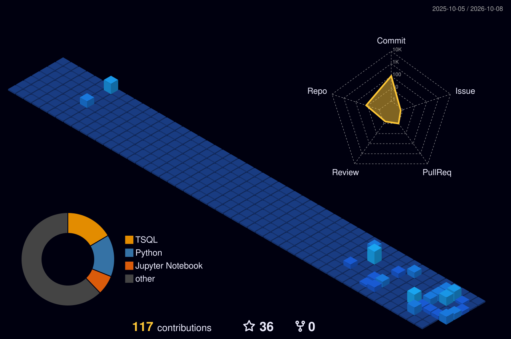

# 👋 Hi there, I'm Sifaw!

### 🚀 Data Engineering | Data Analytics | Machine Learning

**Turning raw data into meaningful insights.**

---

## 🧠 About Me

I'm passionate about Data Engineering, Data Analytics, and Artificial Intelligence.

- 🔭 Building end-to-end data pipelines and analytics solutions
- 🌱 Exploring Dataiku, Databricks, Apache Airflow and Machine Learning
- 📊 Interested in Business Intelligence and data visualization
- ⚙️ Working with Python, SQL and modern data platforms
- 🎯 Focused on building scalable, reliable and efficient data solutions
- 📍 Based in France

---

## 🛠️ Tech Stack

### 💻 Programming Languages & Data

### ⚙️ Data Engineering & Cloud

### 🤖 Machine Learning & AI

---

## 🚀 Featured Projects

### 💱 Dataiku FX Analytics & Machine Learning

End-to-end currency exchange analytics pipeline.

**Key Features:**
- API data ingestion
- Data cleaning and transformation
- Data analytics and visualization
- Machine Learning integration

**Technologies:** Dataiku, Python, APIs, ML

[🔗 View Project](https://github.com/datasifaw/dataiku-fx-api-analytics-ml)

---

### 🏦 Databricks Banking Lakehouse

Modern banking data pipeline built with Lakehouse architecture.

**Key Features:**
- Bronze, Silver and Gold data layers
- Data ingestion and transformation
- Scalable data processing
- Analytics-ready datasets

**Technologies:** Databricks, PySpark, Delta Lake

[🔗 View Project](https://github.com/datasifaw/databricks-projet-bancaire-lakehouse)

---

### 🔄 Airflow Sales Data Pipeline

Automated sales data processing workflow.

**Key Features:**
- Workflow orchestration
- ETL pipeline automation
- Task scheduling
- Data transformation

**Technologies:** Apache Airflow, Python, ETL

[🔗 View Project](https://github.com/datasifaw/sazotech-airflow-sales-data-pipeline)

---

### 🧠 Facial Emotion Recognition

Deep Learning project for facial expression classification.

**Key Features:**
- Facial expression recognition
- CNN model training
- ResNet18 architecture
- Image classification

**Technologies:** Python, PyTorch, CNN, ResNet18

[🔗 View Project](https://github.com/datasifaw/Projet_Expressions_faciales-motions-)

---

## 📊 GitHub Statistics

---

## 📈 GitHub Contribution Activity

---

---

## 🏙️ My 3D Contribution Graph

---

## 🐍 Watch My Contributions Get Eaten!

<picture>
  <source media="(prefers-color-scheme: dark)"
    srcset="https://raw.githubusercontent.com/datasifaw/datasifaw/output/github-contribution-grid-snake-dark.svg">
  <source media="(prefers-color-scheme: light)"
    srcset="https://raw.githubusercontent.com/datasifaw/datasifaw/output/github-contribution-grid-snake.svg">
  
</picture>

---

---

## 🎯 Current Focus

- 🔹 Data Engineering & ETL/ELT Pipelines
- 🔹 Modern Data Lakehouse Architecture
- 🔹 Workflow Orchestration with Apache Airflow
- 🔹 Machine Learning & Artificial Intelligence
- 🔹 Data Visualization & Business Intelligence
- 🔹 Scalable Data Processing

---

## 🤝 Connect With Me

---

### ⭐ Thanks for visiting my GitHub profile!

**Data • Engineering • Analytics • AI**

